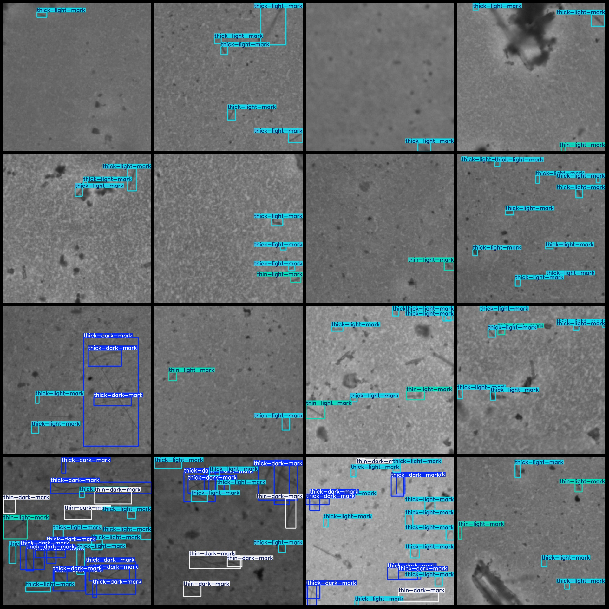

# Shimian Meiwaoren Jiaozheng Jishu VOC+YOLO Shijie1314 Zhang 4 Chongbai

The dataset format is Pascal VOC format + YOLO format (the txt file does not contain the segmentation path, only contains jpg images and the corresponding VOC format xml files and yolo format txt 
files).

Number of images (jpg file count): 1314
Number of annotations (xml file count): 1314
Number of annotations (txt file count): 1314
Number of annotation categories: 4
Annotation category names (note that the order of categories in the yolo format is not consistent with this, but according to the labels folder classes.txt): ["thick-dark-mark", "thick-light-mark", 
"thin-dark-mark", "thin-light-mark"]
Each category has a number of bounding boxes:
"thick-dark-mark" (thick dark mark) = 1751
"thick-light-mark" (thick light mark) = 5909
"thin-dark-mark" (thin dark mark) = 969
"thin-light-mark" (thin light mark) = 817
Total bounding box count: 9446
Image resolution: 832x832
Annotation tool used: labelImg
Annotation rules: draw square bounding boxes for each category
Important note: The dataset does not have been divided into training, validation, or test sets; you need to do so yourself.
Special declaration: This dataset does not guarantee the accuracy of the trained models or weight files.
Image preview:

## Image

Here is a pay link on Stripe ( https://buy.stripe.com/3cs8yP7sY87d0vu9AB ). Please contact me lonlonago@foxmail.com after funding $89, and I will send you a complete data files , thank you!

